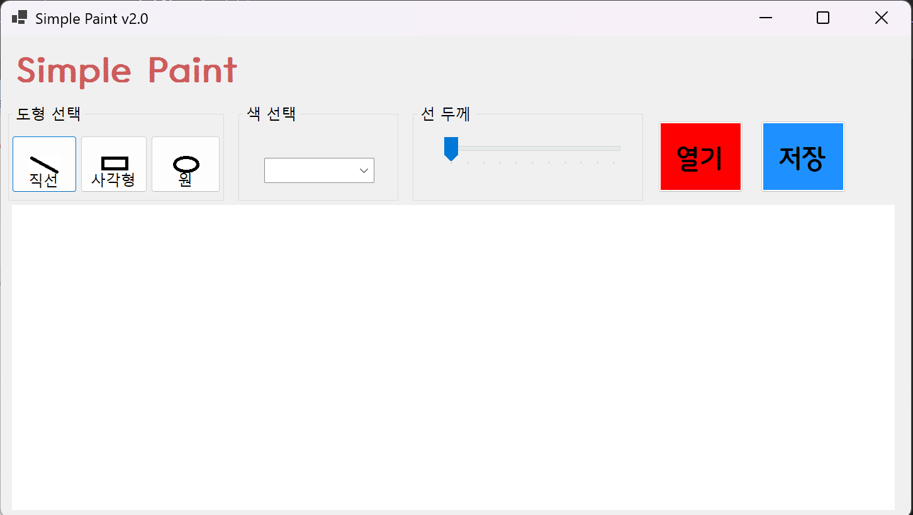

# (C# 코딩) 그림판(SimplePaint)

## 개요
-C# 프로그래밍학습
-1줄소개: 실제 원과 사각형과 원을 그릴 수 있는 그림판 프로그램

-사용한플랫폼: 
-C#, .NET Windows Forms, Visual Studio, GitHub

-사용한컨트롤:
-Label, Button, Combobox, Trackbar, Picturebox, Groupbox

-사용한기술과구현한기능:
- 그림판 기능을 구현하기 위한 기본적인 UI 구성

## 실행화면(과제1)

-코드의실행스크린샷과구현내용설명

-구현한내용(위그림참조)
- 기본적인 UI를 구성하였습니다.
- 새롭게 이용한 것은 combobox, trackbar 였습니다.
- 이런 새로운 컨트롤들을 이용하여 실제 그림판과 비슷한 UI를 구성하였습니다.
- 도형 그리기: 선택한 도형과 색상, 선굵기에 따라 그림판에 도형을 그리는 기능을 구현
- 도형 선택: Button을 직선, 사각형, 원 중에서 선택할 수 있게 구현
- 색 선택: Combobox를 이용하여 검정, 빨강, 파랑, 녹색 중에 선택할 수 있게 구현
- 선 굵기: Trackbar를 이용하여 선 굵기를 0~10 사이에서 선택할 수 있게 구현

## 실행화면(과제2)

-코드의실행스크린샷과구현내용설명

-구현한내용(위그림참조)

## 실행화면(과제3)

-코드의실행스크린샷과구현내용설명

-구현한내용(위그림참조)

## 실행화면(과제4)

-코드의실행스크린샷과구현내용설명

-구현한내용(위그림참조)
