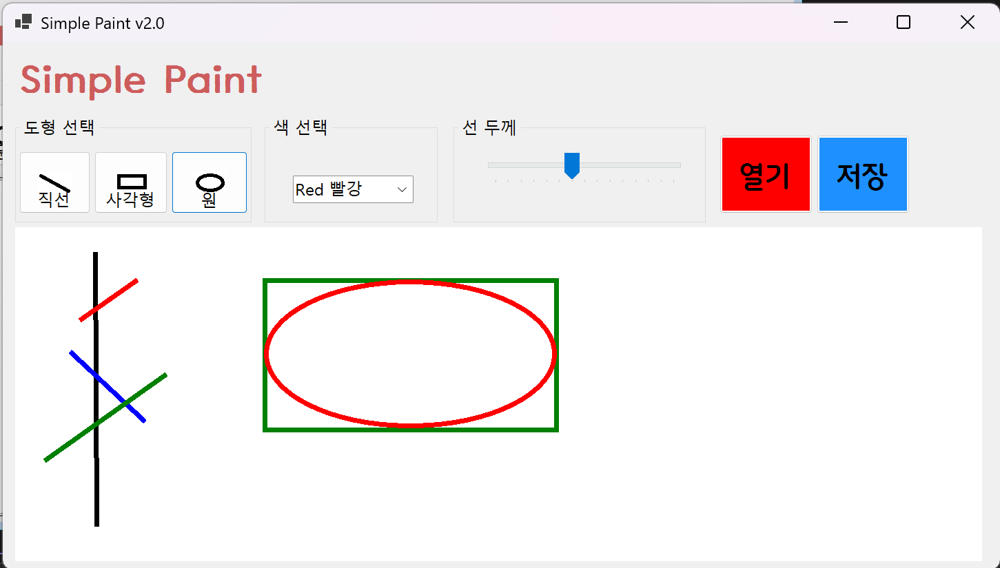
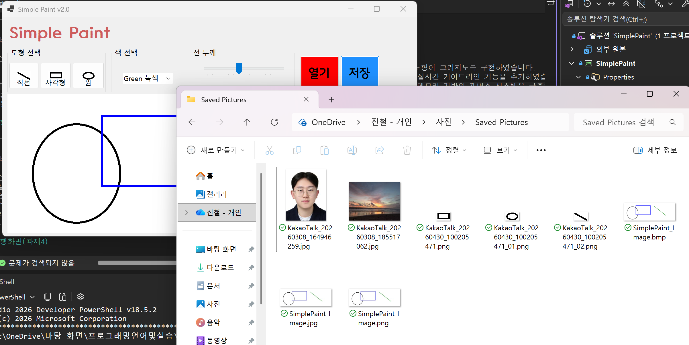

# (C# 코딩) 그림판(SimplePaint)

## 개요
-C# 프로그래밍학습
-1줄소개: 직선과 원과 사각형을 그릴 수 있는 그림판 프로그램

-사용한플랫폼: 
-C#, .NET Windows Forms, Visual Studio, GitHub

-사용한컨트롤:
-Label, Button, Combobox, Trackbar, Picturebox, Groupbox

-사용한기술과구현한기능:
- 그림판 기능을 구현하기 위한 기본적인 UI 구성

## 실행화면(과제1)

-코드의실행스크린샷과구현내용설명

-구현한내용(위그림참조)
- 기본적인 UI를 구성하였습니다.
- 새롭게 이용한 것은 combobox, trackbar 였습니다.
- 이런 새로운 컨트롤들을 이용하여 실제 그림판과 비슷한 UI를 구성하였습니다.
- 도형 그리기: 선택한 도형과 색상, 선굵기에 따라 그림판에 도형을 그리는 기능을 구현
- 도형 선택: Button을 직선, 사각형, 원 중에서 선택할 수 있게 구현
- 색 선택: Combobox를 이용하여 검정, 빨강, 파랑, 녹색 중에 선택할 수 있게 구현
- 선 굵기: Trackbar를 이용하여 선 굵기를 0~10 사이에서 선택할 수 있게 구현

## 실행화면(과제2)

- 코드의 실행 스크린샷과 구현 내용 설명

- 구현한 내용(위 그림 참조)
	- 마우스 이벤트 기반 드래그 구현: MouseDown, MouseMove, MouseUp 이벤트를 연결하여 사용자의 마우스 움직임에 따라 도형이 그려지도록 구현하였습니다.
    - 미리보기 기능 구현: picCanvas_Paint 이벤트를 활용하여, 마우스를 떼기 전까지 도형이 그려질 위치를 미리 보여주는 실시간 가이드라인 기능을 추가하였습니다.
- 비트맵 도화지 시스템: Bitmap과 Graphics 객체를 생성하여, 화면이 가려지거나 리사이즈되어도 그림 데이터가 유지되도록 메모리 기반의 캔버스 시스템을 구축하였습니다.
- 도형 그리기 로직 최적화: 시작점과 끝점의 좌표를 계산하여 어느 방향으로 드래그해도 사각형과 원이 올바르게 그려지도록 GetRectangle 함수를 구현하였습니다.
- UI 동적 연동: 버튼 클릭을 통한 도형 모드 변경, 콤보박스를 통한 색상 변경, 트랙바를 통한 선 두께 변경 값을 그리기 로직에 실시간으로 반영하였습니다.

## 실행 화면 (과제 3)

- 코드의 실행 스크린샷과 구현 내용 설명

- 구현한 내용 (위 그림 참조)
- 파일 저장 시스템 구축: SaveFileDialog를 활용하여 사용자가 원하는 경로와 파일 이름으로 작업물을 저장할 수 있는 인터페이스를 구현하였습니다.
- 다중 포맷 지원: 파일 확장자 필터 설정을 통해 PNG, JPG, BMP의 세 가지 주요 이미지 포맷을 선택하여 저장할 수 있도록 기능을 확장하였습니다.
- 동적 포맷 판별 로직: System.IO.Path.GetExtension을 사용하여 사용자가 입력한 파일명의 확장자를 분석하고, 그에 맞는 ImageFormat을 자동으로 매칭하여 저장하는 로직을 구현하였습니다.
- 예외 처리 및 사용자 피드백: 저장 과정에서 발생할 수 있는 파일 접근 권한 문제나 경로 오류를 try-catch 문으로 처리하였으며, 저장 완료 시 성공 메시지를 출력하여 사용자 경험을 개선하였습니다.
- 물리적 파일 생성 확인: 실제 로컬 디렉토리에 각 포맷별로 파일이 정상 생성되는지 검증하였으며, 외부 사진 뷰어와의 호환성 테스트를 완료하였습니다.

## 실행 화면 (과제 4 - 마우스 휠 인터페이스)

- 코드의 실행 스크린샷과 구현 내용 설명

- 구현한 내용 (위 그림 참조)
    이미지 크기 기반 캔버스 조정: 불러온 이미지의 원본 해상도에 맞춰 비트맵 크기를 자동으로 설정하여 고해상도 이미지를 온전히 수용하도록 구현하였습니다.
    마우스 휠 확대 축소: 번개 아이콘(이벤트) 목록 외에 코드 레벨에서 MouseWheel 이벤트를 직접 연결하여 사용자 친화적인 줌 기능을 추가하였습니다.
    지능형 스크롤 시스템: PictureBox의 크기를 배율에 따라 동적으로 계산하고 부모 패널의 AutoScroll 속성을 활용하여 가려진 영역을 탐색할 수 있는 스크롤바를 생성하였습니다.
    컨트롤 계층 최적화: PictureBox의 Parent 속성을 Panel로 지정하고 Dock 설정을 해제하여 배율 변경 시 레이아웃이 깨지지 않고 정상적으로 리사이징되도록 처리하였습니다.